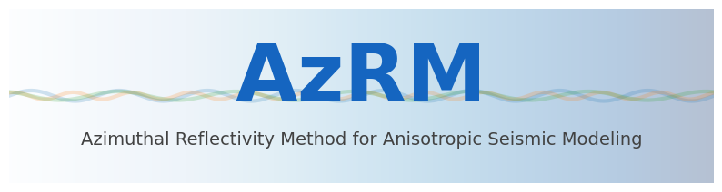
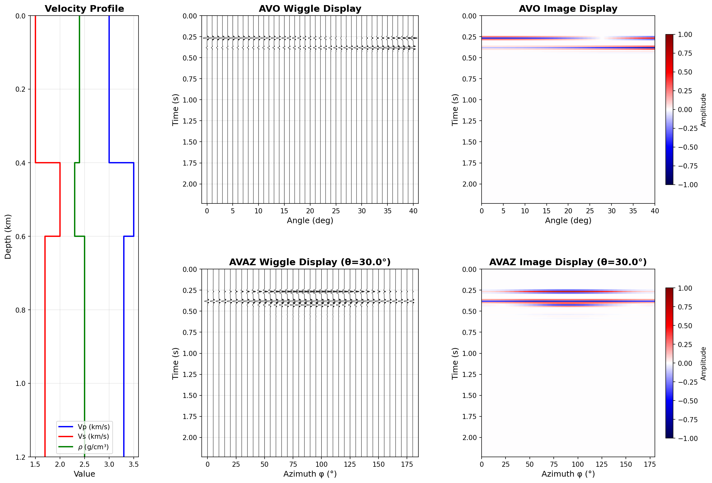
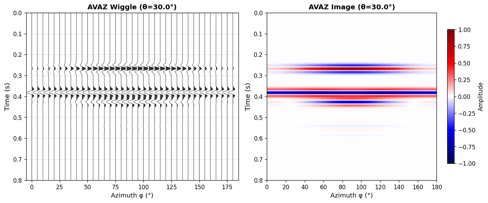
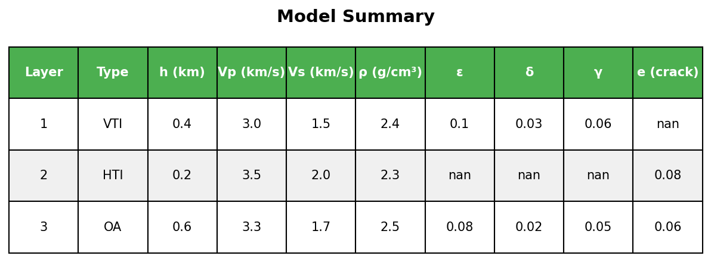

<p align="center">
  
</p>

<h1 align="center">AzRM</h1>
<h3 align="center">Azimuthal Reflectivity Method for Anisotropic Seismic Modeling</h3>

<p align="center">
  <strong>High-performance seismic forward modeling with interactive visualization</strong>
</p>

<p align="center">
  <a href="#features">Features</a> •
  <a href="#installation">Installation</a> •
  <a href="#quick-start">Quick Start</a> •
  <a href="docs/USER_GUIDE.md">User Guide</a> •
  <a href="#citation">Citation</a>
</p>

<p align="center">
  
  
  
  
  
</p>

<p align="center">
  
</p>

---

## Why AzRM?

**AzRM** implements the **reflectivity method** for computing 1D plane-wave seismic gather records in **arbitrary anisotropic horizontally layered media**. Unlike traditional convolution-based models, AzRM makes **no restrictive assumptions** (single interface, small angles, weak impedance contrast), enabling accurate modeling of:

- **Multiple reflections** and **transmission losses** in layered media
- **Arbitrary anisotropic media** (ISO, VTI, HTI, Orthorhombic)
- **AVO & AVAZ analysis** for fracture characterization and reservoir analysis

<table>
<tr>
<td width="50%">

### The Problem
Traditional **convolution models** rely on restrictive assumptions:
- Single interface approximation
- Small-angle approximation
- Weak impedance contrast
- No multiple reflections
- Limited to simple anisotropy

These limitations fail to capture the complex wave propagation in realistic layered anisotropic media.

</td>
<td width="50%">

### The Solution
AzRM's **reflectivity method** provides:
- ✅ **No restrictive assumptions** - handles arbitrary layer contrasts
- ✅ **Full multiple modeling** - includes all internal multiples
- ✅ **Transmission loss** - accurate amplitude modeling
- ✅ **Arbitrary anisotropy** - ISO, VTI, HTI, Orthorhombic
- ✅ **AVO & AVAZ analysis** - complete angle and azimuth coverage

</td>
</tr>
</table>

---

## Features

<table>
<tr>
<td align="center" width="25%">
<br>
<b>High Performance</b><br>
<small>C++ core with OpenMP parallelization</small>
</td>
<td align="center" width="25%">
<br>
<b>Full Anisotropy</b><br>
<small>ISO, VTI, HTI, Orthorhombic</small>
</td>
<td align="center" width="25%">
<br>
<b>Interactive GUI</b><br>
<small>Web-based Streamlit interface</small>
</td>
<td align="center" width="25%">
<br>
<b>Flexible Export</b><br>
<small>PNG, JSON, MAT formats</small>
</td>
</tr>
</table>

### Key Capabilities

```
✓ Synthetic seismic gathers (angle domain)     ✓ AVAZ gathers (azimuth domain)
✓ AVO & AVAZ curve analysis                    ✓ Multi-layer modeling with multiples
✓ Velocity profile visualization               ✓ Real-time parameter adjustment
✓ Thomsen parameter support                    ✓ Hudson crack model for HTI
```

---

## Gallery

<table>
<tr>
<td align="center">
<br>
<b>Seismic Gather</b>
</td>
<td align="center">
<br>
<b>AVAZ Analysis</b>
</td>
</tr>
<tr>
<td align="center">
<br>
<b>AVO Curves</b>
</td>
<td align="center">
<br>
<b>Model Editor</b>
</td>
</tr>
</table>

---

## Installation

### Prerequisites

| Requirement | Version | Installation |
|------------|---------|--------------|
| Python | 3.8+ | [python.org](https://python.org) |
| Eigen3 | 3.3+ | `brew install eigen` (macOS) |
| pybind11 | 2.10+ | `pip install pybind11` |

### Quick Install

```bash
# Clone the repository
git clone https://github.com/yourusername/AzRM.git
cd AzRM

# Install Python dependencies
pip install -r webapp/requirements.txt

# Build C++ module
chmod +x build_python.sh
./build_python.sh

# Verify installation
python3 -c "import sys; sys.path.insert(0,'webapp'); import azrm; print(f'✓ AzRM {azrm.__version__} ready!')"
```

---

## Quick Start

### Launch the GUI

```bash
cd webapp
streamlit run app.py
```

Then open http://localhost:8501 in your browser.

### Python API

```python
import numpy as np
import azrm
from stiffness import build_model_stiffness

# Define a fractured reservoir model
layers = [
    {'type': 'VTI', 'thickness': 0.5, 'vp': 3.0, 'vs': 1.5, 'rho': 2.3,
     'epsilon': 0.05, 'delta': 0.02, 'gamma': 0.03},
    {'type': 'HTI', 'thickness': 0.3, 'vp': 3.5, 'vs': 1.8, 'rho': 2.5,
     'crack_density': 0.05}  # Fractured layer
]

# Build model and compute
thickness, density, stiffness = build_model_stiffness(layers)
angles = np.arange(0, 41, 1.0)

# Compute Rpp at different azimuths to see AVAZ effect
for phi in [0, 45, 90]:
    Rpp, _, _ = azrm.compute_Rpp(25.0, angles, thickness, density, stiffness, phi)
    print(f"φ={phi:3d}°: |Rpp(30°)| = {abs(-Rpp[30]):.4f}")
```

**Output:**
```
φ=  0°: |Rpp(30°)| = 0.0856
φ= 45°: |Rpp(30°)| = 0.0623
φ= 90°: |Rpp(30°)| = 0.0412  ← Azimuthal variation!
```

---

## Documentation

### Supported Media Types

| Type | Symmetry | Parameters | Physical Model |
|------|----------|------------|----------------|
| **ISO** | Isotropic | Vp, Vs, ρ | Homogeneous rock |
| **VTI** | Hexagonal (vertical axis) | + ε, δ, γ | Shale, layered sediments |
| **HTI** | Hexagonal (horizontal axis) | + crack density | Vertical fractures |
| **OA** | Orthorhombic | + ε, δ, γ, crack density | Fractured shale |

### Algorithm

AzRM implements the **reflectivity method** (Fryer & Frazer, 1984, 1987):

```
┌─────────────────────────────────────────────────────────────────┐
│  Input: Layer parameters (Vp, Vs, ρ, anisotropy)                │
│                              ↓                                  │
│  1. Build 6×6 stiffness tensors (Voigt notation)                │
│                              ↓                                  │
│  2. Solve Christoffel equation → Eigenvalues & Eigenvectors     │
│                              ↓                                  │
│  3. Apply Kennett recursive algorithm (bottom → top)            │
│                              ↓                                  │
│  4. Compute Rpp(f, θ, φ) for all frequencies                    │
│                              ↓                                  │
│  5. Apply wavelet & IFFT → Time-domain seismogram               │
│                              ↓                                  │
│  Output: Synthetic gather with all internal multiples           │
└─────────────────────────────────────────────────────────────────┘
```

### Project Structure

```
AzRM/
├── cpp/                      # C++ core (high-performance engine)
│   ├── include/azrm_core.hpp # API declarations
│   ├── src/
│   │   ├── azrm_core.cpp     # Reflectivity algorithm
│   │   └── python_binding.cpp # pybind11 interface
│   └── CMakeLists.txt
├── webapp/                   # Streamlit GUI
│   ├── app.py                # Main application
│   ├── stiffness.py          # Stiffness tensor construction
│   └── seismic_plot.py       # Visualization
├── docs/                     # Documentation & assets
└── build_python.sh           # Build script
```

---

## Performance

Benchmarked on Apple M1 Pro (8 cores):

| Model Complexity | Frequencies | Angles | Azimuths | Time |
|-----------------|-------------|--------|----------|------|
| 2 layers | 256 | 41 | 1 | 0.3s |
| 5 layers | 512 | 41 | 37 | 4.2s |
| 10 layers | 512 | 41 | 37 | 12.1s |

---

## Citation

If you use AzRM in your research, please cite:

```bibtex
@article{yang2025azrm,
  title={An effective azimuthal reflectivity modeling (AzRM) tool for
         generating seismic data in anisotropic shale reservoirs},
  author={Yang, Rui and Chen, Huaizhen and Guo, Zhiqi and others},
  journal={Geophysics},
  volume={90},
  number={5},
  pages={1--76},
  year={2025},
  publisher={Society of Exploration Geophysicists}
}
```

### Key References

- Fryer & Frazer (1984, 1987) - Reflectivity method for anisotropic media
- Kennett (1983) - Recursive algorithm for layered media
- Thomsen (1986) - Weak elastic anisotropy parameters
- Hudson (1981) - Crack-induced anisotropy model

---

## Contributing

Contributions are welcome! Please feel free to submit a Pull Request.

1. Fork the repository
2. Create your feature branch (`git checkout -b feature/AmazingFeature`)
3. Commit your changes (`git commit -m 'Add some AmazingFeature'`)
4. Push to the branch (`git push origin feature/AmazingFeature`)
5. Open a Pull Request

---

## License

This project is licensed under the MIT License - see the [LICENSE](LICENSE) file for details.

---

## Author

<table>
<tr>
<td align="center">
<b>Rui Yang</b><br>
<small>Tongji University / Stanford University</small><br>
<a href="mailto:yangrui199711@gmail.com">Email</a> •
<a href="https://github.com/RuiYang-Geophysicist">GitHub</a>
</td>
</tr>
</table>

---

<p align="center">
  <sub>Built with ❤️ for the geophysics community</sub>
</p>

<p align="center">
  <a href="#azrm">⬆ Back to Top</a>
</p>
